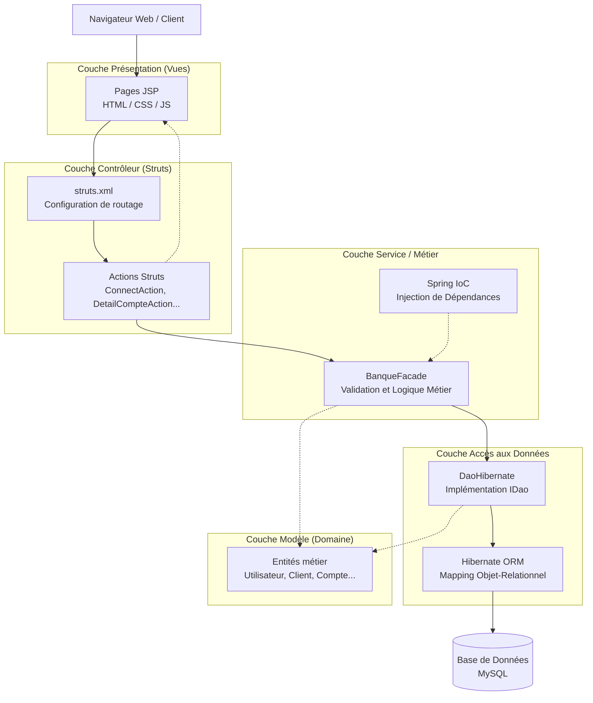

# Architecture du Projet IUT Bank (ASBank)

Ce document présente l'architecture logicielle globale du projet IUT Bank (ASBank-2025). L'application repose sur une architecture multi-tiers (N-Tier) utilisant principalement le modèle MVC (Modèle-Vue-Contrôleur) avec les frameworks **Struts 2**, **Spring** et **Hibernate**.

## Diagramme d'Architecture

Voici le schéma illustrant les différentes couches de l'application et leurs interactions :

## Description des Couches

1. **Couche Présentation (Vue)** : gère l'affichage pour l'utilisateur. Elle est développée avec des pages **JSP** (JavaServer Pages) stockées dans le dossier `WebContent`.
2. **Couche Contrôleur** : utilise le framework **Struts 2**. Les interactions de l'utilisateur sur la Vue déclenchent des requêtes qui sont dirigées par le fichier `struts.xml` vers la classe **Action** correspondante (ex: `ConnectAction`, `DetailCompteAction`, `ResetPasswordAction`).
3. **Couche Service (Métier)** : implémentée par la classe **`BanqueFacade`**, qui centralise toute la logique fonctionnelle de la banque (vérification des soldes, authentications, découverst, etc.). Elle agit comme point de contact unique pour le Contrôleur. Elle est gérée par le conteneur **Spring** (IoC) pour faciliter l'injection de dépendances.
4. **Couche d'Accès aux Données (DAO)** : implémentation de l'interface `IDao` via la classe **`DaoHibernate`**. Son but est d'abstraire les opérations de la base de données.
5. **Couche ORM / Persistance** : **Hibernate** est utilisé pour mapper les entités objets métiers (les classes Java) aux tables relationnelles correspondantes dans la base de données relationnelle **MySQL**.
6. **Modèle** : Les entités (`Utilisateur`, `Client`, `Gestionnaire`, `Compte`, `CompteAvecDecouvert`) qui représentent l'information métier transversale transférée entre la base de données et les différentes couches.
